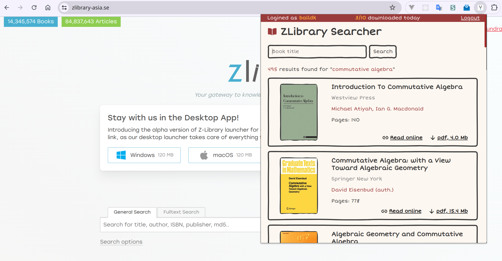

# ZLibrary Searcher Chrome Extension

A chrome extension that let users quickly search and download books from ZLibrary



## Usage

Run the following commands to build our extension

```
npm install
npm run build
```

Then go to `Manage extension -> Turn on Developement mode -> Load unpacked -> choose "build" folder`
