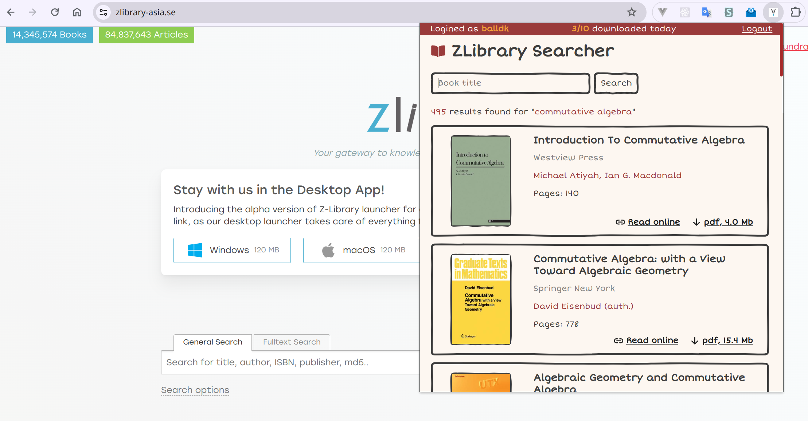

# ZLibrary Searcher Chrome Extension

A chrome extension that let users quickly search and download books from ZLibrary



## Usage

You can either download the extension directly from Chrome Web Store: https://chromewebstore.google.com/detail/zlibrary-searcher/hacdelicpoafdkmkehadcdfkmkakiclf, or build the extension on your own by running

```
npm install
npm run build
```

Then go to `Manage extension -> Turn on Developement mode -> Load unpacked -> choose "build" folder`
